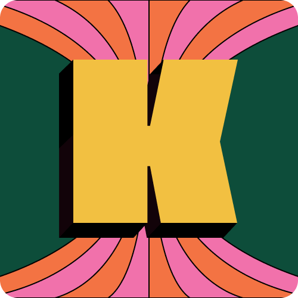

<p align="center">
  
  <h1 align="center">
  KIKANKOI
  </h1>
</p>

<h2 align="center">
Présentation
</h2>

<p>
KIKANKOI a été créé lors de la Startup Weekend de Nantes 2023. 
<br></br>
Avec KIKANKOI c’est des défis entre potes, conçu pour révéler des sports insolites.
</p>

<h2 align="center">
Installation
</h2>

1. Cloner le repo
``` bash
git clone git@github.com:AdrienLanco0/Quiquampoix.git
```

2. Installer les dépendences
``` bash
npm install
```

3. Démarrer le serveur dev
``` bash
ionic serve
```
    
<h2 align="center">
Langages et outils
</h2>

<p align="center" style="display: flex; justify-content: space-evenly; align-items:center; flex-wrap: wrap;"> 
  <a href="https://ionicframework.com/" target="_blank" rel="noreferrer"> 
     
  </a>
  <a href="https://sass-lang.com" target="_blank" rel="noreferrer"> 
     
  </a> 
  <a href="https://www.typescriptlang.org/" target="_blank" rel="noreferrer"> 
     
  </a> 
  <a href="https://developer.mozilla.org/en-US/docs/Web/JavaScript" target="_blank" rel="noreferrer">   
     
  </a> 
  <a href="https://www.w3.org/html/" target="_blank" rel="noreferrer"> 
     
  </a> 
  <a href="https://www.w3.org/html/" target="_blank" rel="noreferrer"> 
     
  </a>
</p>

<h2 align="center">Contributeurs</h2>

- Robin GOUTARD
- Paul BREMOND
- Aurélie POTTIER
- Ewen PARC
- Joris VENTAJA
- Kylan METZNER
- Pierre BOURDEAU
- Adrien LANCO
- Raphaël REYNAUD